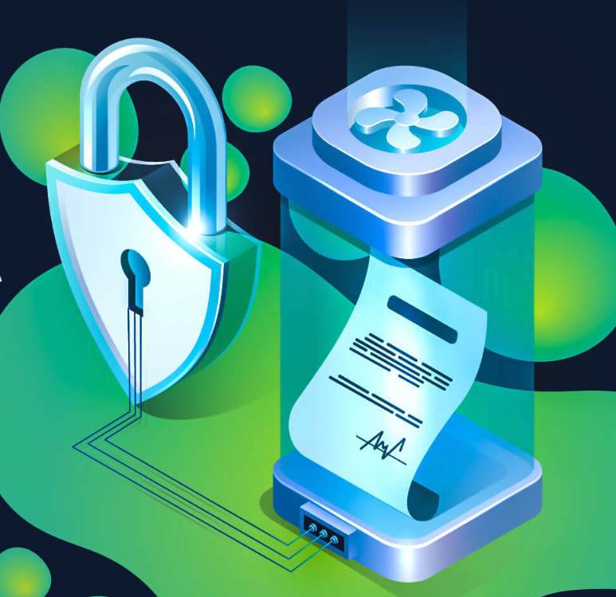

<a name="readme-top"></a>

[![Contributors][contributors-shield]][contributors-url]
[![Forks][forks-shield]][forks-url]
[![Stargazers][stars-shield]][stars-url]
[![Issues][issues-shield]][issues-url]
[![MIT License][license-shield]][license-url]
[![LinkedIn][linkedin-shield]][linkedin-url]

<!-- PROJECT LOGO -->
<br />
<div align="center">
  <a href="https://github.com/Aboudoc/Reentrancy-demo">
    
  </a>

<h3 align="center">Reentrancy Attack</h3>

  <p align="center">
    project_description
    <br />
    <a href="https://github.com/Aboudoc/Ethernaut-OpenZeppelin"><strong>Explore the docs »</strong></a>
    <br />
    <br />
    <a href="https://github.com/Aboudoc/Ethernaut-OpenZeppelin">View Demo</a>
    ·
    <a href="https://github.com/Aboudoc/Ethernaut-OpenZeppelin/issues">Report Bug</a>
    ·
    <a href="https://github.com/Aboudoc/Ethernaut-OpenZeppelin/issues">Request Feature</a>
  </p>
</div>

<!-- TABLE OF CONTENTS -->
<details>
  <summary>Table of Contents</summary>
  <ol>
    <li>
      <a href="#about-the-project">About The Project</a>
      <ul>
        <li><a href="#built-with">Built With</a></li>
      </ul>
    </li>
    <li>
      <a href="#getting-started">Getting Started</a>
      <ul>
        <li><a href="#prerequisites">Prerequisites</a></li>
        <li><a href="#installation">Installation</a></li>
      </ul>
    </li>
    <li><a href="#usage">Usage</a></li>
    <li><a href="#roadmap">Roadmap</a></li>
    <li><a href="#contributing">Contributing</a></li>
    <li><a href="#license">License</a></li>
    <li><a href="#contact">Contact</a></li>
    <li><a href="#acknowledgments">Acknowledgments</a></li>
  </ol>
</details>

<!-- ABOUT THE PROJECT -->

## About The Project

[![Product Name Screen Shot][product-screenshot]](https://example.com)

<p align="right">(<a href="#readme-top">back to top</a>)</p>

### Built With

- [![Hardhat][Hardhat]][Hardhat-url]
- [![Ethers][Ethers.js]][Ethers-url]

<p align="right">(<a href="#readme-top">back to top</a>)</p>

<!-- GETTING STARTED -->

## Getting Started

To get a local copy up and running follow these simple example steps.

## Getting Started

To get a local copy up and running follow these simple example steps.

### Prerequisites

- npm

  ```sh
  npm install npm@latest -g
  ```

- hardhat

  ```sh
  npm install --save-dev hardhat
  ```

  ```sh
  npm install @nomiclabs/hardhat-ethers @nomiclabs/hardhat-waffle
  ```

  run:

  ```sh
  npx hardhat
  ```

### Installation

1. Clone the repo
   ```sh
   git clone https://github.com/Aboudoc/Reentrancy-demo.git
   ```
2. Install NPM packages
   ```sh
   npm install
   ```

<p align="right">(<a href="#readme-top">back to top</a>)</p>

<!-- USAGE EXAMPLES -->

## Usage

If you need testnet funds, use the [Alchemy testnet faucet](https://goerlifaucet.com/).

**This project shows the re-entrancy attack and how to protect against it**

### Checks-Effects-Interactions Pattern

The simplest way to eliminate reentrancy bugs is to use the [checks-effects-interactions pattern](https://docs.soliditylang.org/en/v0.5.11/security-considerations.html#re-entrancy).

```js
    function withdraw() external {
        require(balances[msg.sender] > 0);
        (bool success, ) = msg.sender.call{value: balances[msg.sender]}("");
        require(success);
        balances[msg.sender] = 0;
    }
```

If `msg.sender` is a smart contract, it has an opportunity to call `withdraw()` again before the next line happens. In that second call, `balanceOf[msg.sender]` is still the original amount, so it will be transferred again. This can be repeated as many times as necessary to drain the smart contract.

```js
    function withdraw() external {
        require(balances[msg.sender] > 0);
        balances[msg.sender] = 0;
        (bool success, ) = msg.sender.call{value: balances[msg.sender]}("");
        require(success);
    }
```

The idea of the checks-effects-interactions pattern is to make sure that all your interactions (external calls) happen at the end

### Use a Reentrancy Guard

Another approach to preventing reentrancy is to explicitly check for and reject such calls. Here’s a simple version of a reentrancy guard so you can see the idea:

```js
    bool locked = false;

    function withdraw() external {
        require(!locked, "Reentrant call detected")

        locked = true;
        require(balances[msg.sender] > 0);
        (bool success, ) = msg.sender.call{value: balances[msg.sender]}("");
        require(success);
        balances[msg.sender] = 0;

        lock = false;
    }
```

With this code, if a reentrant call is attempted, the require will reject it because lock is still set to true

A more sophisticated and gas-efficient version of this can be found in [OpenZeppelin’s](https://github.com/OpenZeppelin/openzeppelin-contracts/blob/e5da0986bbc3217c4c82a3a7ca6a9a312599c74c/contracts/utils/ReentrancyGuard.sol) `ReentrancyGuard contract`. If you inherit from ReentrancyGuard, you just need to decorate functions with nonReentrant to prevent reentrancy.

Please note that this method only protects you **if you explicitly apply it to all the right functions**. It also carries an increased gas cost due to the need to persist a value in storage.

### Stop Using Solidity's transfer()

[EIP-1884](https://eips.ethereum.org/EIPS/eip-1884) increases the gas cost of the SLOAD operation and therefore breaks some existing smart contracts because their fallback functions used to consume less than 2300 gas, and they’ll now consume more.

Why is 2300 gas significant? It’s the amount of gas a contract’s fallback function receives if it’s called via [Solidity’s transfer() or send() methods](https://docs.soliditylang.org/en/v0.5.11/units-and-global-variables.html#members-of-address-types).

Since its introduction, transfer() has typically been recommended by the security community because it helps guard against reentrancy attacks. This guidance made sense under the assumption that gas costs wouldn’t change, but that assumption turned out to be incorrect. We now recommend that transfer() and send() be avoided.

Any smart contract that uses `transfer()` or `send()` is taking a hard dependency on gas costs by forwarding a fixed amount of gas: 2300.

The whole reason `transfer()` and `send()` were introduced was to address the cause of the infamous [hack on The DAO](https://blog.openzeppelin.com/15-lines-of-code-that-could-have-prevented-thedao-hack-782499e00942/). The idea was that 2300 gas is enough to emit a log entry but insufficient to make a reentrant call that then modifies storage.

Remember, though, that gas costs are subject to change, which means this is a bad way to address reentrancy anyway. When Constantinople fork was delayed it was because lowering gas costs caused code that was previously safe from reentrancy to no longer be.

<p align="right">(<a href="#readme-top">back to top</a>)</p>

<!-- ROADMAP -->

## Roadmap

- [ ] unit test

See the [open issues](https://github.com/Aboudoc/Reentrancy-demo/issues) for a full list of proposed features (and known issues).

<p align="right">(<a href="#readme-top">back to top</a>)</p>

<!-- CONTRIBUTING -->

## Contributing

Contributions are what make the open source community such an amazing place to learn, inspire, and create. Any contributions you make are **greatly appreciated**.

If you have a suggestion that would make this better, please fork the repo and create a pull request. You can also simply open an issue with the tag "enhancement".
Don't forget to give the project a star! Thanks again!

1. Fork the Project
2. Create your Feature Branch (`git checkout -b feature/AmazingFeature`)
3. Commit your Changes (`git commit -m 'Add some AmazingFeature'`)
4. Push to the Branch (`git push origin feature/AmazingFeature`)
5. Open a Pull Request

<p align="right">(<a href="#readme-top">back to top</a>)</p>

<!-- LICENSE -->

## License

Distributed under the MIT License. See `LICENSE.txt` for more information.

<p align="right">(<a href="#readme-top">back to top</a>)</p>

<!-- CONTACT -->

## Contact

Reda Aboutika - [@twitter](https://twitter.com/AboutikaR) - reda.aboutika@gmail.com

Project Link: [https://github.com/Aboudoc/Reentrancy-demo](https://github.com/Aboudoc/Reentrancy-demo)

<p align="right">(<a href="#readme-top">back to top</a>)</p>

<!-- ACKNOWLEDGMENTS -->

## Acknowledgments

- [Patrick Collins](https://github.com/PatrickAlphaC)

<p align="right">(<a href="#readme-top">back to top</a>)</p>

<!-- MARKDOWN LINKS & IMAGES -->
<!-- https://www.markdownguide.org/basic-syntax/#reference-style-links -->

[contributors-shield]: https://img.shields.io/github/contributors/Aboudoc/Ethernaut-OpenZeppelin.svg?style=for-the-badge
[contributors-url]: https://github.com/Aboudoc/Ethernaut-OpenZeppelin/graphs/contributors
[forks-shield]: https://img.shields.io/github/forks/Aboudoc/Ethernaut-OpenZeppelin.svg?style=for-the-badge
[forks-url]: https://github.com/Aboudoc/Ethernaut-OpenZeppelin/network/members
[stars-shield]: https://img.shields.io/github/stars/Aboudoc/Ethernaut-OpenZeppelin.svg?style=for-the-badge
[stars-url]: https://github.com/Aboudoc/Ethernaut-OpenZeppelin/stargazers
[issues-shield]: https://img.shields.io/github/issues/Aboudoc/Ethernaut-OpenZeppelin.svg?style=for-the-badge
[issues-url]: https://github.com/Aboudoc/Ethernaut-OpenZeppelin/issues
[license-shield]: https://img.shields.io/github/license/Aboudoc/Ethernaut-OpenZeppelin.svg?style=for-the-badge
[license-url]: https://github.com/Aboudoc/Ethernaut-OpenZeppelin/blob/master/LICENSE.txt
[linkedin-shield]: https://img.shields.io/badge/-LinkedIn-black.svg?style=for-the-badge&logo=linkedin&colorB=555
[linkedin-url]: https://www.linkedin.com/in/r%C3%A9da-aboutika-34305453/?originalSubdomain=fr
[product-screenshot]: https://i1.wp.com/blog.openzeppelin.com/wp-content/uploads/2019/05/Solidity-1.png?fit=1200%2C633&ssl=1
[Hardhat]: https://img.shields.io/badge/Hardhat-20232A?style=for-the-badge&logo=hardhat&logoColor=61DAFB
[Hardhat-url]: https://hardhat.org/
[Ethers.js]: https://img.shields.io/badge/ethers.js-000000?style=for-the-badge&logo=ethersdotjs&logoColor=white
[Ethers-url]: https://docs.ethers.org/v5/
[Vue.js]: https://img.shields.io/badge/Vue.js-35495E?style=for-the-badge&logo=vuedotjs&logoColor=4FC08D
[Vue-url]: https://vuejs.org/
[Angular.io]: https://img.shields.io/badge/Angular-DD0031?style=for-the-badge&logo=angular&logoColor=white
[Angular-url]: https://angular.io/
[Svelte.dev]: https://img.shields.io/badge/Svelte-4A4A55?style=for-the-badge&logo=svelte&logoColor=FF3E00
[Svelte-url]: https://svelte.dev/
[Laravel.com]: https://img.shields.io/badge/Laravel-FF2D20?style=for-the-badge&logo=laravel&logoColor=white
[Laravel-url]: https://laravel.com
[Bootstrap.com]: https://img.shields.io/badge/Bootstrap-563D7C?style=for-the-badge&logo=bootstrap&logoColor=white
[Bootstrap-url]: https://getbootstrap.com
[JQuery.com]: https://img.shields.io/badge/jQuery-0769AD?style=for-the-badge&logo=jquery&logoColor=white
[JQuery-url]: https://jquery.com
